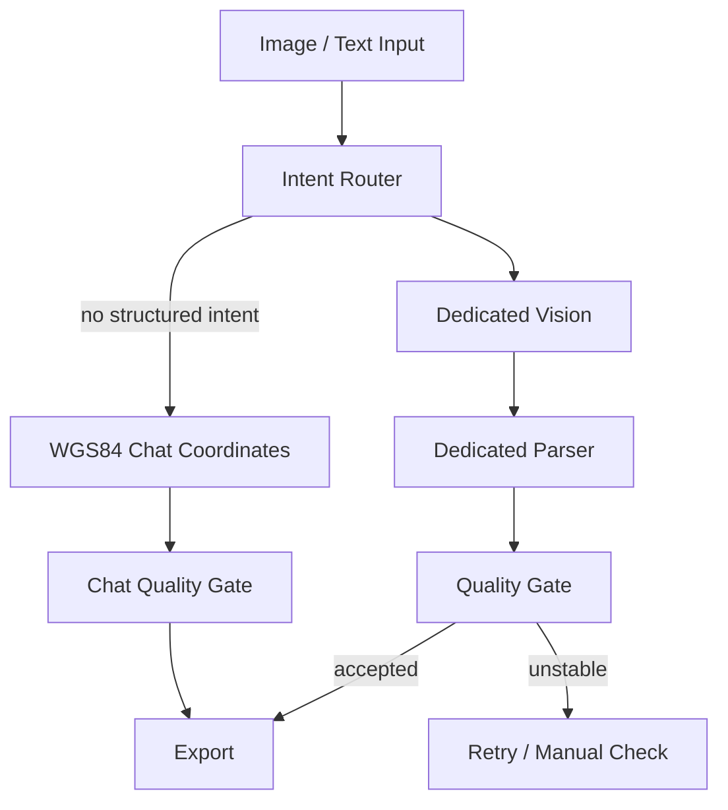
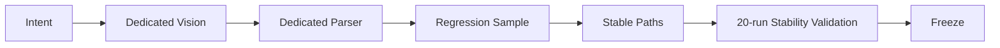

# Coordinate Engine Development Specification

Version: V1.0

Status: FROZEN

Effective Date: 2026-07-01

Applies To:

- `server.js`
- `index.html`
- All Coordinate Parsers
- All new coordinate types

## Coordinate Engine V1.5 Architecture

GeoKit Lab Coordinate Engine V1.5 freezes coordinate recognition as a typed,
intent-routed pipeline. The goal is to stop cross-parser regressions: fixing one
coordinate type must not change another type's behavior.

This document is design-only. It does not change runtime behavior by itself.

This document is also the Coordinate Engine development standard. Any coordinate
recognition change must be reviewed against this document before it is committed.

## Core Pipeline



## Layer Responsibilities

### Image / Text Input

- Receives uploaded images, OCR text, pasted text, or API text.
- Does not decide coordinate type.
- Does not transform DMS, projected coordinates, MGRS, or table values.

### Intent Router

The Intent Router is the only layer allowed to decide which coordinate type is
being handled.

Responsibilities:

- Detect coordinate type from filename, OCR hints, table headers, layout,
  language, numeric ranges, and known sample context.
- Route to exactly one structured coordinate intent where possible.
- Prevent low-priority parsers from competing with structured types.
- Produce a traceable decision such as `OCR -> BFTM:accepted` or
  `OCR -> MOZAMBIQUE_GEOGRAPHIC:rejected_unstable`.

Non-responsibilities:

- It must not parse final coordinates.
- It must not export KML.
- It must not silently fall through to Chat when a structured table is suspected
  but unstable.

### Dedicated Vision

Dedicated Vision is type-specific visual extraction.

Responsibilities:

- Read only the intended table or prose block for that coordinate type.
- Preserve row order, point labels, table grouping, and original coordinate
  structure.
- Avoid generic document transcription.

Non-responsibilities:

- It must not normalize all coordinate formats into decimal WGS84 unless that is
  the dedicated type's declared output.
- It must not borrow rows or values from other table areas.
- It must not be broadened to fix one sample if doing so affects other types.

### Dedicated Parser

Parsers are deterministic translators for a known type.

Responsibilities:

- Parse one coordinate type only.
- Each coordinate type has exactly one owning Dedicated Parser.
- Accept input only after Intent Router has selected the type or the dedicated
  vision retry has returned type-specific output.
- Preserve labels, row order, groups, duplicate boundary points, and projected
  coordinate semantics where the type requires them.

Non-responsibilities:

- Parser must not guess the coordinate type.
- Parser must not compete with other parsers.
- Parser must not correct unrelated OCR text outside its type boundary.
- Parser must not "also support" another coordinate system as a convenience fix.

### Quality Gate

Quality Gate decides whether parsed results are safe to export.

Responsibilities:

- Validate row count, label continuity, coordinate ranges, duplicate policy,
  projection consistency, and expected geometry.
- Reject unstable results before export.
- Prefer "retry/manual check" over a wrong KML.
- On failure, choose only one of:
  - retry within the same coordinate type,
  - return an unstable/manual-check result.

Non-responsibilities:

- It must not generate missing rows.
- It must not switch coordinate types.
- It must not hand a failed structured type to Chat.
- It must not hand a failed structured type to any other parser.

### Export

Export consumes only accepted, typed coordinate objects.

Responsibilities:

- Generate Point / LineString / Polygon / MultiPolygon from Quality Gate accepted
  data.
- Use the coordinate order declared by the type.
- Write KML coordinates as `longitude,latitude,0`.
- Preserve grouped polygons where the type has groups.

Non-responsibilities:

- Export must not re-parse workspace text with Chat or fallback logic.
- Export must not infer a different coordinate type.
- Export must not flatten grouped polygons unless the accepted type explicitly
  says so.

## Chat Fallback Principle

WGS84 Chat Coordinates is a final fallback only.

Allowed:

- Plain pasted decimal WGS84 coordinates without table headers or structured
  context.
- Non-structured chat messages with simple `lat,lon` coordinate pairs.

Forbidden:

- Capturing BFTM, UTM, MGRS, DMS, WGS84 longitude/latitude tables, Mozambique
  tables, Madagascar grids, Kyrgyz GK, French perimeter prose, or Point A-Z
  tables.
- Interpreting structured OCR residue as chat coordinates.
- Exporting KML from a structured type that failed its own Quality Gate.
- Running Chat when Intent Router has detected any structured coordinate intent,
  even if that structured type later fails Quality Gate.

## Current Coordinate Types

| Type | Intent Features | Dedicated Vision | Dedicated Parser | Quality Gate | Export |
| --- | --- | --- | --- | --- | --- |
| BFTM Projected XY | `BFTM`, `Coordonnees en BFTM (XY)`, `Sommets`, `X(m)`, `Y(m)`, Burkina projected ranges | BFTM table retry, read X/Y rows only | BFTM projected X/Y parser | projected numeric ranges, row count, no WGS84/Chat takeover, OCR digit repair only inside BFTM context | BFTM projection to WGS84, Polygon |
| WGS84 Table (RC2) | Chinese/English longitude then latitude headers, `经度东`, `北纬`, `Longitude`, `Latitude`, labels A/B/C/O | WGS84 lon/lat table retry/rescue | WGS84 table parser with `coordinateOrder=lonlat` | preserve duplicate boundary points for table retry, range check, no Chat takeover | Direct KML from KML column / lon,lat rows, Polygon or grouped Polygon |
| WGS84 Chat | plain decimal text, no structural headers, no special coordinate context | none by default | WGS84 chat parser | valid WGS84 ranges, swapped warning only, not allowed for structured types | Point / LineString / Polygon by point count |
| Mozambique Geographic Table | `COORDENADAS GEOGRAFICAS`, `Datum: Tete`, `Latitude`, `Longitude`, `Ordem`, `INAMI`, `MIREME` | Mozambique table prompt and DMS transcription prompt | Portuguese geographic DMS table parser | exact expected order rows, continuous order, no unstable duplicate tail, no Chat fallback | `Mozambique Geographic Table | order | lat | lon | KML`, Polygon |
| MGRS / UTM Grid Reference | zone 1-60, band C-X excluding I/O, grid square, equal easting/northing digits, labels A-G | MGRS retry | MGRS parser | legal zone/band/grid, equal digit length, latitude band consistency, no Chat/UTM numeric takeover | WGS84 Point / LineString / Polygon |
| Kyrgyzstan GK | Russian table, `№ точек`, `X`, `Y`, 13xxxxxx / 46xxxxx, Kyrgyz filename/context | Kyrgyz GK prompt / retry | Point-X-Y Gauss-Kruger parser | point starts at 1, continuous, no abnormal >200, EPSG:28413 range check | EPSG:28413 to WGS84, sorted Polygon |
| Madagascar Cadastral | `Liste_Carres`, `num | XV | YV`, cadastral grid, Madagascar context | Madagascar cadastral table prompt | cadastral grid parser | expected grid rows, ignore map DMS labels, XV/YV projected grid range | EPSG:29702 cell polygons, WGS84 KML |
| French Perimeter DMS | `Coordonnees du perimetre`, `meridien`, `parallele`, `Ouest`, `Nord`, Point A-D prose | French perimeter DMS retry | French prose DMS parser | point labels, west negative longitude, north positive latitude, no Point A-Z table capture | Polygon from prose points |
| Point A-Z DMS Table | `Point`, `Nord`, `Est` / `Ouest`, A-Z table rows, 26 points | Point A-Z DMS table retry | Point A-Z DMS parser | A-Z label continuity, expected row count, table structure, French parser must reject it | Polygon preserving A-Z order |
| DMS Grouped | `Mining Area`, repeated DMS groups, number restart, blank-line grouped DMS | DMS grouped retry where needed | grouped DMS parser | group count, each group point count, no flattening, no local DMS fallback override | MultiPolygon / separate Polygon Placemarks |
| Standard / Ordinary DMS | DMS pairs with N/S/E/W, ordinary coordinate list | DMS prompt if image-based | DMS parser | valid degree/minute/second ranges, leading label strip, quote tolerance | Point / LineString / Polygon |
| UTM XY | UTM zone context such as `utm30n`, projected X/Y values not BFTM | UTM table read if needed | UTM numeric XY parser | zone known, projected ranges, must not be promoted to BFTM without BFTM intent | UTM to WGS84, Polygon |

## Parser Priority Baseline

V1.5 keeps the V1 stable priority concept but moves type selection into Intent
Router:

1. DMS_GROUPED
2. Point A-Z DMS Table
3. French Perimeter DMS
4. Ordinary DMS
5. BFTM / X-Y
6. MGRS / UTM Grid Reference
7. Kyrgyzstan GK
8. Madagascar cadastral
9. Mozambique Geographic Table
10. WGS84 Table with longitude/latitude headers
11. UTM XY
12. WGS84 Chat Coordinates
13. fallback / manual check

The exact implementation may keep existing code order where necessary, but the
observable behavior must obey the intent hierarchy: structured types cannot be
captured by Chat or by unrelated parsers.

## Quality Gate Principles

- A result is exportable only after the type-specific Quality Gate accepts it.
- Row count must match the type expectation where known.
- Labels and order must be preserved.
- Duplicate boundary points are allowed only where the type requires them.
- OCR repair is allowed only inside the owning type's context.
- A failed structured type must return a clear retry/manual-check message.
- A failed structured type must not be downgraded into Chat.
- "No KML" is safer than wrong KML.

## Export Principles

- Export receives typed accepted data, not raw OCR text.
- Export must never re-run Chat extraction over accepted structured coordinates.
- Export must use the accepted type's declared coordinate order.
- KML coordinate order is always `longitude,latitude,0`.
- Point count determines geometry only after type acceptance:
  - 1 point: Point
  - 2 points: LineString
  - 3+ points: Polygon
  - grouped types: MultiPolygon / multiple Polygon Placemarks

## Freeze Policy

Coordinate Engine V1.5 is frozen under these rules:

1. Do not modify generic OCR prompt to fix one coordinate type.
2. Do not modify WGS84 Chat to support structured coordinate tables.
3. Do not allow parsers to compete for type detection.
4. Do not make one parser support multiple coordinate systems.
5. Do not export unaccepted structured results.
6. Do not make fallback OCR override high-confidence dedicated results.
7. Do not submit coordinate changes without regression evidence.
8. Do not make opportunistic compatibility changes such as "also parse this
   other coordinate type" inside an existing parser.
9. Do not modify a generic OCR or vision prompt unless regression evidence proves
   the change does not affect every existing stable type.

## Red Lines

These actions are forbidden unless the Coordinate Engine architecture itself is
explicitly revised first:

- Do not modify the generic OCR prompt to fix a single sample.
- Do not make WGS84 Chat compatible with any structured coordinate type.
- Do not allow one parser to own two coordinate systems.
- Do not add a new coordinate type without a regression sample.
- Do not commit when the relevant regression set is failing.
- Do not treat a single successful upload as stable for image-based types.
- Do not export KML from `rows=0`, non-continuous, nonconforming, or unstable
  structured results.
- Do not let a failed Quality Gate fall through to Chat, decimal fallback, local
  OCR fallback, or another parser.
- Do not repair OCR numbers outside the owning coordinate type's context.

## New Coordinate Type Rule

Any future coordinate type must include all of the following:

1. New Intent Router rule.
2. Dedicated Vision prompt or explicit "no vision needed" note.
3. Dedicated Parser.
4. Quality Gate.
5. Export mapping.
6. Regression sample directory and README.
7. Stable Paths update.
8. Full Coordinate Engine regression run.
9. Consecutive stability validation, recommended 20 real uploads for image-based
   types.

If any required item is missing, the change must not be committed.

The required development flow is:



## Change Impact Checklist

Every coordinate change must include an explicit impact assessment before commit.

```text
Change title:

Intent:
[ ] No impact
[ ] Adds new intent
[ ] Changes existing intent:

Vision:
[ ] No impact
[ ] Adds dedicated vision prompt
[ ] Changes dedicated vision prompt:
[ ] Changes generic OCR / generic vision prompt:

Parser:
[ ] No impact
[ ] Adds parser:
[ ] Changes parser:
[ ] Parser remains single-type:

Quality Gate:
[ ] No impact
[ ] Adds gate:
[ ] Changes gate:
[ ] Failure cannot fall through to Chat or another parser:

Export:
[ ] No impact
[ ] Changes export mapping:
[ ] Export consumes accepted typed data only:

Regression:
[ ] Existing stable samples run:
[ ] New sample added:
[ ] Types affected:

Chat:
[ ] No impact
[ ] Possible impact explained:
[ ] Structured input cannot be captured by Chat:
```

If the checklist cannot be completed, the change must not be committed.

## Coordinate Engine Release Checklist

Before any coordinate recognition commit or release:

```text
[ ] Code change is limited to the declared type or layer.
[ ] Intent Router behavior is documented.
[ ] Dedicated Parser remains single-type.
[ ] Quality Gate failure returns retry/manual-check, not another parser.
[ ] Export uses accepted typed data only.
[ ] WGS84 Chat did not capture structured samples.
[ ] Regression samples were added or confirmed not needed.
[ ] Stable Paths were updated.
[ ] Architecture document was updated or confirmed unchanged.
[ ] Full Coordinate Engine regression passed.
[ ] Consecutive stability validation passed for image-based fragile types.
[ ] No unrelated files, backup files, secrets, or temporary samples are included.
```

If any box fails, do not submit the change.

## Implementation Plan

### Phase 1: Documentation Freeze

- Keep current runtime behavior unchanged.
- Use this document as the architecture contract for all future coordinate work.
- Continue recording unstable samples in `regression-samples/`.

### Phase 2: Intent Router Extraction

- Introduce a single intent object:
  - `type`
  - `confidence`
  - `evidence`
  - `blockedFallbacks`
  - `parserTrace`
- Move type selection out of parsers where possible.
- Keep existing parser outputs unchanged during extraction.

### Phase 3: Dedicated Result Objects

- Standardize accepted output:
  - `precisionMode`
  - `type`
  - `points` or `groups`
  - `sourceRows`
  - `quality`
  - `exportGeometry`
  - `kmlCoordinates`
- Make frontend export consume this typed object instead of reparsing workspace
  text.

### Phase 4: Deterministic Table Reading

- For repeated fragile table types such as Mozambique Geographic Table, move away
  from repeated visual guessing.
- Add deterministic row extraction where possible:
  - table crop
  - cell-aware transcription
  - fixed row count validation
  - stable expected row schema
- If deterministic extraction fails, return manual-check instead of falling back
  to Chat.

### Phase 5: Regression Automation

- Convert `regression-samples/` expectations into runnable tests.
- Require all stable coordinate types to pass before any coordinate commit.
- Keep 20-run stability tests for image-based fragile types.

## Revision History

### V1.0

- Established the Intent Router architecture.
- Defined the Dedicated Parser principle.
- Defined Quality Gate principles.
- Defined WGS84 Chat as the final fallback only.
- Added the Coordinate Engine Release Checklist.
- Added the Change Impact Checklist.
- Added Red Lines for coordinate recognition changes.
